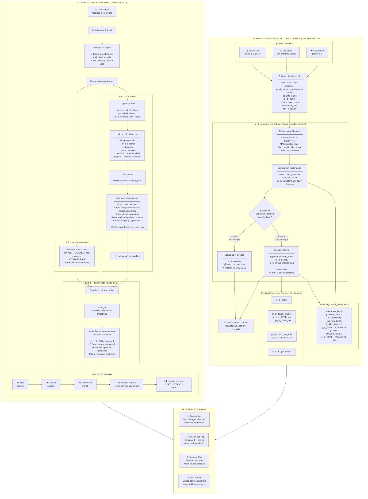

# Architecture Diagram

## Current Architecture

```mermaid
flowchart TD
    subgraph LAYER1["🚀 LAYER 1 — SELECTIVE DEPLOYMENT (CI/CD)"]
        direction TB

        DEV["👨‍💻 Developer\nModifies pl_di_if144e"]
        PR["Pull Request Raised"]
        VALIDATE["validate-on-pr.yml\n─────────────────\n✔ Manifest well-formed\n✔ All pipelines exist\n✔ Dependency closure valid"]
        MERGE["Merge to develop branch"]

        subgraph BUILD["JOB 2 — adf-build"]
            MANIFEST["📄 pipelines.json\n─────────────────\npipelines: [pl_di_if144e]\nexcludePipelines: [pl_di_common_env_setup]"]
            SELECT["select_adf_subset.py\n─────────────────\nBFS graph walk\n→ child pipelines\n→ datasets\n→ linked services\n→ AKV LS → credentials/IR\nStages → build/adf_subset/"]
            NPM["npm export\n→ ARMTemplateForFactory.json"]
            STRIP["strip_arm_resources.py\n─────────────────\nStrips: linkedServices\nStrips: integrationRuntimes\nStrips: credentials\nStrips: globalparameters\nStrips: excludePipelines by name\nCleans: dangling dependsOn\n→ ARMTemplateForFactory.safe.json"]
            ARTIFACT["📦 Upload adf-arm artifact"]
        end

        subgraph MATRIX["JOB 1 — prepare-matrix"]
            MATRIXJOB["Validates branch rules\ndevelop → DEV/TEST only\nrelease → UAT/STAGE/PROD\nBuilds environment matrix"]
        end

        subgraph DEPLOY["JOB 3 — deploy (per environment)"]
            DOWNLOAD["Download adf-arm artifact"]
            AZLOGIN["az login\nNONPROD or PROD credentials"]
            AZDEPLOY["az deployment group create\n--mode Incremental\n─────────────────\n✅ pl_di_if144e deployed\n✅ Dependencies deployed\n🔒 30 other pipelines untouched\n🔒 Infra resources protected"]
        end

        subgraph PROMOTE["PROMOTION PATH"]
            direction LR
            P1["develop\nbranch"]
            P2["DEV/TEST\nvalidate"]
            P3["release/version\nbranch"]
            P4["adf-release-publish\n→ GitHub Release artifact"]
            P5["adf-release-promote\n→ UAT → STAGE → PROD"]
            P1 --> P2 --> P3 --> P4 --> P5
        end

        DEV --> PR --> VALIDATE --> MERGE
        MERGE --> MATRIXJOB
        MERGE --> MANIFEST
        MANIFEST --> SELECT --> NPM --> STRIP --> ARTIFACT
        MATRIXJOB --> DOWNLOAD
        ARTIFACT --> DOWNLOAD
        DOWNLOAD --> AZLOGIN --> AZDEPLOY
        AZDEPLOY --> PROMOTE
    end

    subgraph LAYER2["⚡ LAYER 2 — RUNTIME EXECUTION CONTROL (ORCHESTRATOR)"]
        direction TB

        subgraph SOURCES["Upstream Sources"]
            ORA["🗄️ Oracle DB\n(on-prem via SHIR)"]
            FS["📁 File Share\n(on-prem via SHIR)"]
            BLOB["☁️ Azure Blob\n(Azure IR)"]
        end

        TIDAL["⏰ TIDAL SCHEDULER\n─────────────────\nREST API → ADF\npipeline: pl_di_common_orchestrator\nparams:\n  pipeline_name: pl_di_if144e\n  source_type: oracle\n  watermark_key: if144e_source"]

        subgraph ORCH["pl_di_common_orchestrator (single reusable pipeline)"]
            META["GetMetadata / Lookup\n─────────────────\nOracle: SELECT COUNT(*), MAX(updated_date)\nFile:   lastModified + size\nBlob:   lastModified"]
            WM["Lookup: adf_watermarks\n─────────────────\nSELECT last_modified, last_row_count\nWHERE watermark_key = @param"]
            COND{"IfCondition\nSource unchanged\nsince last run?"}
            SKIP["SetVariable: skipped\n─────────────────\n⚡ ~8 seconds\n💰 Zero compute cost\n✅ Tidal sees: SUCCESS"]
            EXEC["ExecutePipeline\n─────────────────\n@param.pipeline_name\n(pl_di_if144e, pl_di_if065b_master etc.)\n\nOn success:\nUPDATE adf_watermarks"]
        end

        subgraph WMTABLE["Azure SQL — adf_watermarks"]
            WMROW["watermark_key | pipeline_name | last_modified | last_row_count\nif144e_source  | pl_di_if144e  | 2026-09-29    | 142857\nif065b_source  | pl_di_if065b  | 2026-09-28    | 3921"]
        end

        subgraph REALPIPELINES["Existing Processing Pipelines (unchanged)"]
            PL1["pl_di_if144e"]
            PL2["pl_di_if065b_master\n→ pl_di_if065b_incr\n→ pl_di_if065b_init"]
            PL3["pl_di_if101c_pre_edq\npl_di_if101c_post_edq"]
            PLN["pl_di_if... (all others)"]
        end

        TIDALOUT["✅ Tidal sees SUCCESS\nDownstream jobs fire normally"]

        ORA & FS & BLOB --> TIDAL
        TIDAL --> META
        META --> WM
        WM <--> WMTABLE
        WM --> COND
        COND -->|"TRUE\nNo change"| SKIP
        COND -->|"FALSE\nData changed"| EXEC
        EXEC --> REALPIPELINES
        EXEC --> WMTABLE
        SKIP --> TIDALOUT
        EXEC --> TIDALOUT
    end

    subgraph SAVINGS["📊 COMBINED SAVINGS"]
        direction LR
        S1["🚀 Deployment\nOnly changed pipelines\ndeployed per release"]
        S2["🔗 Release Coupling\nEliminated — teams\ndeploy independently"]
        S3["💰 Compute Cost\nPipeline only runs\nwhen source changes"]
        S4["🔒 Infra Safety\nLinked services and IRs\nprotected from overwrite"]
    end

    LAYER1 --> SAVINGS
    LAYER2 --> SAVINGS
```
